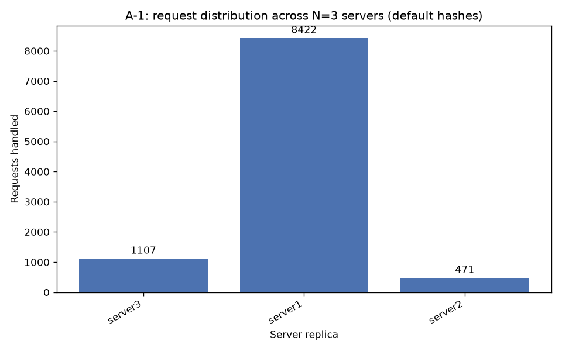
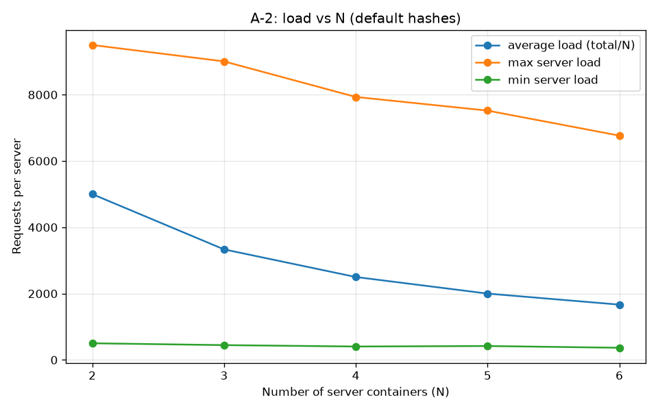
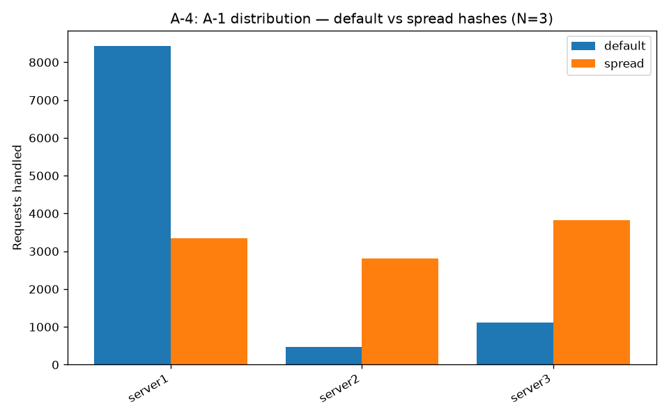
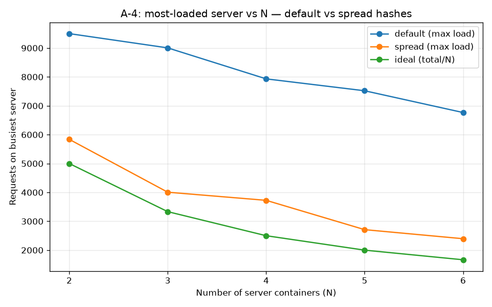

# Customizable Load Balancer 

ICS 4104: Distributed Systems - Assignment 1 

A load balancer that asynchronously distributes client requests across `N` replicated web server containers using **consistent hashing**, running inside a Docker network. The load balancer maintains `N` healthy replicas at all times, spawning new server containers automatically when one fails. 

| Student                  | Admission No. |
|--------------------------|---------------|
| Jonyo Janny              | 166885        |
| Ogutu Cindy Atieno       | 158842        |
| Mukoma Dennis Murage     | 139360        |
| Kemoi Kristina Chebet    | 168652        |

## Architecture 

``` 
                 Docker network: net1 
  ┌──────────────────────────────────────────────┐ 
  │  Server 1   Server 2   Server 3  ...         │  Async 
  │     ▲          ▲          ▲                  │  requests 
  │     └──────────┼──────────┘                  │  ◄────────  Client 1..N 
  │          ┌─────┴──────┐                      │ 
  │          │ LoadBalancer│  port 5000:5000     │ 
  │          │   (N = 3)   │                     │ 
  │          └─────────────┘                     │ 
  └──────────────────────────────────────────────┘ 
``` 

## Project structure 

``` 
. 
├── server/                 # Task 1: minimal web server 
│   ├── server.py 
│   ├── Dockerfile 
│   ├── pyproject.toml 
│   └── uv.lock 
├── loadbalancer/           # Task 3: load balancer service 
│   ├── loadbalancer.py 
│   ├── Dockerfile 
│   ├── pyproject.toml 
│   ├── uv.lock 
│   └── hashing/            # Task 2: consistent hashing 
│       ├── __init__.py 
│       └── consistent_hash.py 
├── analysis/               # Task 4: performance experiments 
├── tests/ 
├── docker-compose.yml 
├── Makefile 
└── README.md 
``` 

## Consistent hashing parameters (Task 2) 

| Parameter | Value | 
|-----------|-------|
| Server containers (N) | 3 |
| Total slots (#slots) | 512 |
| Virtual servers per container (K) | 9 (= log₂ 512) |
| Request hash | H(i) = i² + 2i + 17 |
| Virtual-server hash | Φ(i, j) = i² + j² + 2j + 25 |

Collisions are resolved with linear/quadratic probing.

## Load balancer endpoints (Task 3)

| Method | Path | Purpose |
|--------|------|---------|
| GET | `/rep` | List managed replicas and their count |
| POST | `/add` | Add server instances (optional preferred hostnames) |
| DELETE | `/rm` | Remove server instances |
| GET | `/<path>` | Route request to a replica via consistent hashing |

## Server endpoints (Task 1)

| Method | Path | Purpose |
|--------|------|---------|
| GET | `/home` | Returns `Hello from Server: [ID]` |
| GET | `/heartbeat` | Health check (empty 200 response) |

## Build & run

```bash
make build     # build server + load balancer images
make up        # deploy the full stack via docker-compose
make down      # tear down (also removes spawned replicas)
make logs      # follow load balancer logs
```

The load balancer is exposed on host port **5000** by default (per the
assignment). On hosts where 5000 is taken (e.g. macOS AirPlay Receiver),
override the host port:

```bash
LB_PORT=5050 make up      # LB reachable at http://localhost:5050
```

## Analysis (Task 4)

The `analysis/` project drives the live stack through all four experiments and
generates the figures below. Reproduce with:

```bash
cd analysis && uv run python run.py     # rebuilds images, runs both hash variants
```

It fires **10,000 async requests** (concurrency 100) at the load balancer's
`/home` endpoint and buckets responses by the replica that answered. Charts land
in `analysis/figures/`, raw numbers in `analysis/results/summary.json`.

### A-1 - Load distribution at N = 3 (10,000 requests)



| Server | Requests | Share |
|--------|---------:|------:|
| server1 | 8,422 | 84.2% |
| server3 | 1,107 | 11.1% |
| server2 |   471 |  4.7% |

**Observation:** the load is severely skewed - one server handles ~84% of
requests. This is *not* a bug; it is a direct consequence of the assignment's
mandated hash functions. The virtual-node hash `Φ(i,j) = i² + j² + 2j + 25`,
with server ids 1–3 and j ∈ [0,9), only ever produces positions in the band
**26–114** of the 512-slot ring. The remaining ~78% of the ring is empty, so
every request that hashes into that empty arc wraps clockwise to the
lowest-slot owner (server1). With so few, tightly-clustered virtual nodes the
ring cannot balance the load.

### A-2 - Scalability as N goes 2 → 6 (10,000 requests each)



| N | avg (=total/N) | busiest server | least-loaded |
|---|---------------:|---------------:|-------------:|
| 2 | 5,000 | 9,499 |   501 |
| 3 | 3,333 | 9,005 |   445 |
| 4 | 2,500 | 7,932 |   403 |
| 5 | 2,000 | 7,520 |   418 |
| 6 | 1,667 | 6,766 |   365 |

**Observation:** while the *average* load (total/N) falls as expected, the
**busiest server stays pinned near 7,000–9,500 regardless of N**. Because the
clustered virtual nodes leave one server owning the huge empty arc, adding more
replicas barely relieves the hotspot. The implementation therefore does **not
scale** under the default hash functions - extra capacity sits mostly idle.

### A-3 - Failure recovery

Killing a replica (`docker kill`) at N = 3, the load balancer's heartbeat loop
detects the failure and spawns a replacement to restore the pool:

```
before:   [server1, server_413f2ae3, server_2a7560eb]
docker kill server1
recovered in 0.7s
after:    [server_413f2ae3, server_2a7560eb, server_73cc8731]
```

**Observation:** recovery is automatic and fast (well under one heartbeat
interval here), with the replacement carrying a fresh random hostname. `N` is
maintained without operator intervention. All endpoints (`/rep`, `/add`, `/rm`,
`/<path>`) were also exercised - see `tests/` and the PR verification logs.

### A-4 - Modified hash functions

We replace the spec polynomials with multiplicative (Knuth-style) mixing hashes
that scatter virtual nodes across the **whole** ring (see `spread_request_hash`
/ `spread_virtual_hash`; enable with `HASH_VARIANT=spread`). Repeating A-1 and
A-2:

A-1 (N=3) - default vs spread:



| Server | default | spread |
|--------|--------:|-------:|
| server1 | 8,422 | 3,351 |
| server2 |   471 | 2,819 |
| server3 | 1,107 | 3,830 |

A-2 - busiest server vs N, default vs spread:



| N | default max | spread max | ideal (total/N) |
|---|------------:|-----------:|----------------:|
| 2 | 9,499 | 5,837 | 5,000 |
| 3 | 9,005 | 4,007 | 3,333 |
| 4 | 7,932 | 3,725 | 2,500 |
| 5 | 7,520 | 2,710 | 2,000 |
| 6 | 6,766 | 2,396 | 1,667 |

**Observation:** spreading the virtual nodes across the ring transforms the
behaviour. At N = 3 the load is near-even (~33% each), and the busiest server
now *tracks the ideal `total/N`* as N grows - that is, the load balancer finally
scales. The takeaway: consistent hashing only balances well when the hash
functions distribute virtual nodes uniformly over the ring; the spec's
polynomials do not, which is exactly what A-4 is designed to reveal.

## Design choices & assumptions

- **FastAPI + uvicorn** for both services; **httpx** for async request
  proxying and health checks.
- **Per-service UV projects** (`server/`, `loadbalancer/`, `analysis/`) so each
  Docker image installs only what it needs; dev/analysis deps never enter the
  runtime images.
- **Consistent hashing**: 512 slots, K=9 virtual nodes/server, with **linear
  probing** for slot collisions and `bisect`-based clockwise lookup. Hash
  functions are injectable to support A-4.
- **Replica identity**: each server is launched with `SERVER_ID=<hostname>` so
  `/home` responses are traceable; the load balancer reaches replicas by
  hostname via Docker's `net1` DNS.
- **Request ids**: client requests don't carry one, so the load balancer
  generates a random 6-digit id per request (matching the spec's `H(Rid)`
  model) to choose a replica.
- **Failure recovery** tracks a *dynamic* desired count (`_target_n`) that
  follows `/add` and `/rm`, so scaling survives failures rather than snapping
  back to the static `N`.
- **Container management**: the load balancer drives the host docker daemon via
  the mounted socket; spawned replicas are labelled `role=ds-lb-server` for
  discovery (adoption on restart) and cleanup (`make down`).
- **`privileged: true`** is kept on the LB to match the assignment's Appendix
  C.1 example, though the socket mount alone would suffice.
- **Host port** defaults to 5000 (per the spec); overridable via `LB_PORT` for
  hosts where 5000 is occupied (e.g. macOS AirPlay).

## Testing

Unit/endpoint tests run without a docker daemon (the docker layer is mocked):

```bash
cd loadbalancer && uv run pytest -q      # 35 tests
```

- `tests/test_consistent_hash.py` (17): placement, virtual nodes, collision
  probing (linear + quadratic), clockwise lookup/wrap-around, removal &
  re-routing, distribution sanity, custom-hash injection, param validation,
  atomic `add_server` rollback.
- `tests/test_loadbalancer.py` (15): `/rep`, `/add`, `/rm` validation and error
  paths, plus routing (unknown path → 400, successful proxy), with the docker
  manager and health probing mocked via FastAPI's `TestClient`; hash-variant
  selection validation.
- `tests/test_analysis_loadgen.py` (3): robust parsing and retry behavior for
  transient `/rep` responses during analysis runs.

End-to-end behaviour (real containers: bootstrap, scaling, routing, kill →
respawn) is verified live by the Task 4 analysis run above.

## Performance analysis

See **A-1/A-2/A-4** above. In short: with the spec's hash functions the load
balancer is correct but poorly balanced (one server ~84%, no scaling benefit);
with uniformly-distributing hash functions it balances near-evenly and scales
with N. Failure recovery (A-3) is automatic and sub-second in these runs.
